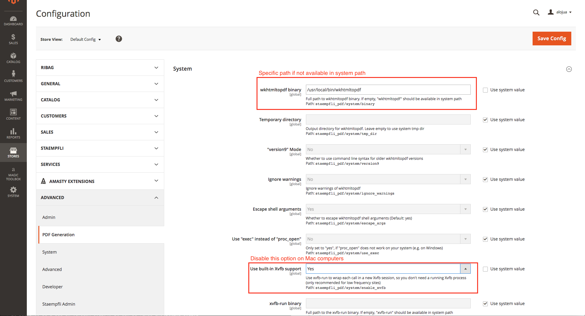

# Magento 2 PDF generator

Magento 2 module to ease the pdf generation using [wkhtmltopdf](https://wkhtmltopdf.org/) features

## Installation

```
composer require "staempfli/magento2-module-pdf":"~1.0"
```

## Setup

### Install wkhtmltopdf
This module needs [wkhtmltopdf](https://wkhtmltopdf.org/) installed on your computer. You can download and install it from here:

* [https://wkhtmltopdf.org/downloads.html](https://wkhtmltopdf.org/downloads.html)

NOTE: Do not install it using `apt-get` on Linux systems. See [troubleshooting](#troubleshooting) section for more info.

### Module configuration

`Stores > Configuration > Advanced PDF Generation`




## Usage

This module can generate a PDF from any `frontControllerAction`

1. Create you Controller path with the correspinding Blocks and `.phtml` templates

	```
	<!-- route_actions_generatePdf.xml -->
	<layout xmlns:xsi="http://www.w3.org/2001/XMLSchema-instance" xsi:noNamespaceSchemaLocation="urn:magento:framework:View/Layout/etc/layout_generic.xsd">
 	   <container name="root">
  	      <block class="Vendor\Package\Block\YourBlock" name="vendor.package.somename">
  	  </container>
	</layout>
	```

2. Return pdf instance on Controller

	```
	<?php
	namespace Vendor\Package\Controller\Actions;

	use Magento\Framework\App\Action\Action;
	use Staempfli\Pdf\Model\View\PdfResult;
	use Staempfli\Pdf\Service\PdfOptions;

	class GeneratePdf extends Action
	{
   		public function execute()
    	{
        	return $this->renderPdfResult();
    	}

    	protected function renderPdfResult()
    	{
        	/** @var PdfResult $result */
        	$result = $this->resultFactory->create(PdfResult::TYPE);
        	$result->addGlobalOptions(
          	  new PdfOptions(
             	   [
             	       PdfOptions::KEY_GLOBAL_TITLE => __('Return PDF'),
             	       PdfOptions::KEY_PAGE_ENCODING => PdfOptions::ENCODING_UTF_8,
             	       PdfOptions::KEY_GLOBAL_ORIENTATION => PdfOptions::ORIENTATION_PORTRAIT,
             	       PdfOptions::FLAG_PAGE_PRINT_MEDIA_TYPE,
             	   ]
            	)
        	);
        	$result->addPageOptions(
          	  new PdfOptions(
             	   [
             	       PdfOptions::KEY_PAGE_COOKIES => ${'_COOKIE'},
             	   ]
            	)
        	);
        	return $result;
    	}
	}
	```

### Header and Footer

Header and footer html can be added as follows:

1. Create your `header.html` and `footer.html` files inside your Module template dir

	```
	<!doctype html>
	<!-- app/code/Vendor/Package/view/frontend/templates/pdf/header.html -->
	<html>
   		<body>
			Header text
	    	</body>
	</html>
	```
	```
	<!doctype html>
	<!-- app/code/Vendor/Package/view/frontend/templates/pdf/footer.html -->
	<html>
    		<body>
			Footer text
    		</body>
	</html>
	```

2. Attach those files to the Controller pdf generation

	```
	<?php
	namespace Vendor\Package\Controller\Actions;

	use Magento\Framework\App\Action\Action;
	use Magento\Framework\View\Element\Template\File\Resolver as TemplateResolver;
	use Staempfli\Pdf\Model\View\PdfResult;
	use Staempfli\Pdf\Service\PdfOptions;

	class GeneratePdf extends Action
	{
	    /**
     	     * @var TemplateResolver
    	     */
    	    private $templateResolver;

    	    public function __construct(
        	TemplateResolver $templateResolver,
        	Context $context
    	    ) {
       	        parent::__construct($context);
 		$this->templateResolver = $templateResolver;
    	    }

            public function execute()
    	    {
                return $this->renderPdfResult();
    	    }

    	    protected function renderPdfResult()
    	    {
        	/** @var PdfResult $result */
        	$result = $this->resultFactory->create(PdfResult::TYPE);
        	$result->addGlobalOptions(
          	  new PdfOptions(
             	   [
             	       PdfOptions::KEY_GLOBAL_TITLE => __('Return PDF'),
             	       PdfOptions::KEY_PAGE_ENCODING => PdfOptions::ENCODING_UTF_8,
             	       PdfOptions::KEY_GLOBAL_ORIENTATION => PdfOptions::ORIENTATION_PORTRAIT,
             	       PdfOptions::FLAG_PAGE_PRINT_MEDIA_TYPE,
             	       PdfOptions::KEY_PAGE_HEADER_SPACING => "10",
             	   ]
            	)
        	);
        	$result->addPageOptions(
          	  new PdfOptions(
             	   [
             	       PdfOptions::KEY_PAGE_COOKIES => ${'_COOKIE'},
             	       PdfOptions::KEY_PAGE_HEADER_HTML_URL => $this->templateResolver
                        ->getTemplateFileName('Vendor_Package::pdf/header.html'),
                    PdfOptions::KEY_PAGE_FOOTER_HTML_URL => $this->templateResolver
                        ->getTemplateFileName('Vendor_ Package::pdf/footer.html'),
             	   ]
            	)
        	);
        	return $result;
    	    }
	}
	```

**NOTE:** Only the header or only the footer as `html` is not possible, either both or none. Otherwise top and bottom margins are ignored.

## Troubleshooting

### The switch --print-media, is not support using unpatched qt:

* `wkhtmltopdf` should not be installed via apt-get. See:
    * http://stackoverflow.com/questions/18758589/wkhtmltopdf-installation-error-on-ubuntu

### Tiny or very small output on Mac:

* It seems to be a bug on `wkhtmltopdf` version 0.12.4. It can be fixed by installing 0.12.3
    * https://stackoverflow.com/questions/40814680/wkhtmltopdf-generates-tiny-output-on-mac

## Requirements
- PHP >= 7.0.*
- Magento >= 2.1.*

## Support
If you have any issues with this extension, open an issue on [GitHub](https://github.com/staempfli/magento2-module-pdf/issues).

## Contribution
Any contribution is highly appreciated. The best way to contribute code is to open a [pull request on GitHub](https://help.github.com/articles/using-pull-requests).

## Developer
Staempfli Webteam, [Fabian Schmengler,  integer_net](https://github.com/schmengler) and all other [contributors](https://github.com/staempfli/magento2-module-pdf/contributors)

## License
[Open Software License ("OSL") v. 3.0](https://opensource.org/licenses/OSL-3.0)

## Copyright
(c) 2018, Stämpfli AG
